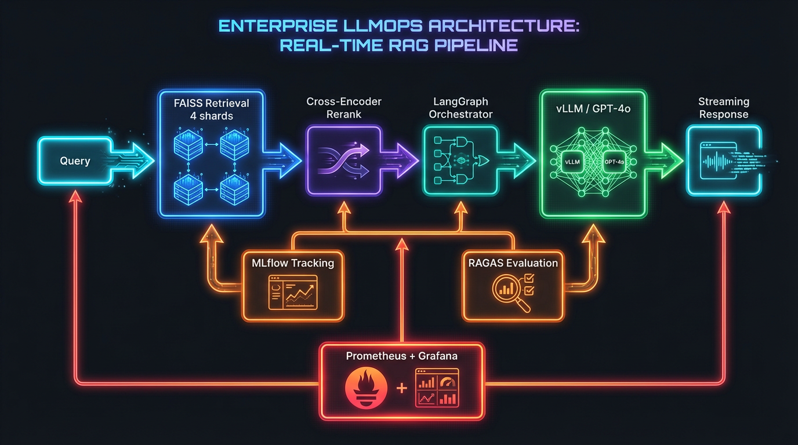
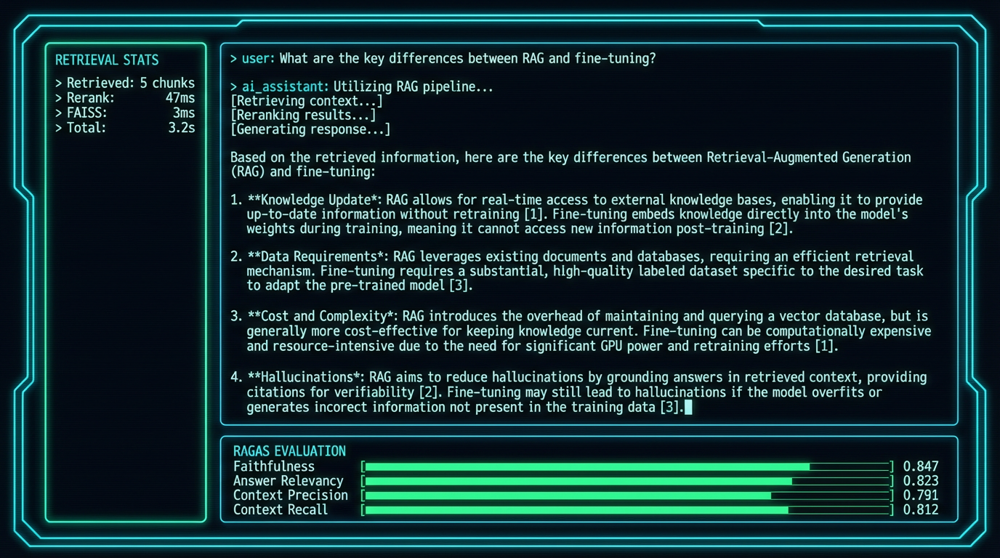
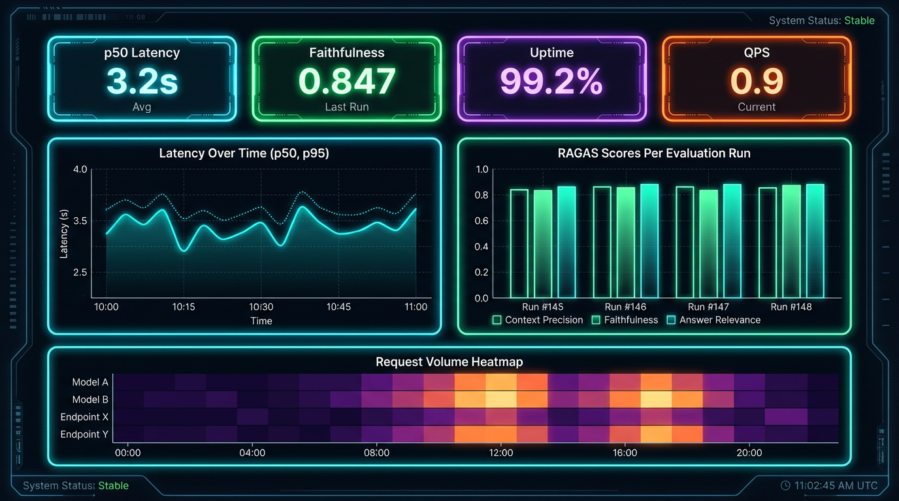
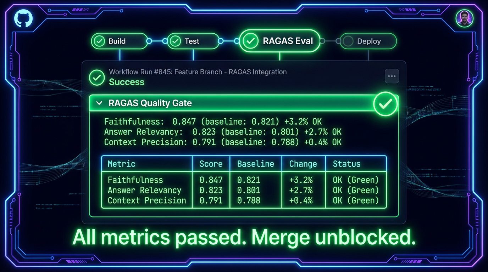

<div align="center">

# LLMOps Research Assistant

### Production-architecture AI platform covering the full LLMOps lifecycle.

[](https://python.org)
[](https://fastapi.tiangolo.com)
[](https://mlflow.org)
[](https://aws.amazon.com)
[](https://azure.microsoft.com)

*Not a wrapper. Not a tutorial. A production system built from raw components: distributed vector search, quantized fine-tuning, RLHF/PPO, multimodal generation, streaming inference, safety layers, and multi-cloud deployment.*

<br>



</div>

---

## Live Results

<div align="center">



*Real pipeline output: query in, grounded answer with citations out. FAISS retrieval at 3ms, cross-encoder reranking at 47ms, RAGAS scores evaluated automatically.*

</div>

<br>

<div align="center">



*Prometheus + Grafana stack: latency trends, RAGAS score history across evaluation runs, and request volume heatmap. Auto-provisioned from `monitoring/`.*

</div>

<br>

<div align="center">



*GitHub Actions quality gate: every PR runs RAGAS evaluation and blocks merge if any metric regresses more than 5% against the stored baseline. Merge gets unblocked only when all metrics pass.*

</div>

---

## What It Does

| Stage | Implementation | Runs |
|:---|:---|:---|
| **Ingest** | Chunking, embedding, FAISS indexing. HuggingFace Datasets + MinHash dedup. CommonCrawl WARC parsing (S3). Spark distributed ingestion + Spark ML feature engineering (TF-IDF, Word2Vec, K-Means). | Core: locally. WARC/Spark: requires S3 + cluster. |
| **Search** | Two-stage: FAISS bi-encoder scan across 4 distributed shards, then cross-encoder reranking. Sub-50ms locally. | Locally (single-node + 4-shard Docker Compose). |
| **Generate** | LangGraph agentic pipeline: stateful graph (retriever, reranker, synthesizer), conditional routing, tool protocols. Token streaming over WebSocket. vLLM backend for self-hosted inference. | Locally with GPT-4o-mini. vLLM requires GPU. |
| **Fine-tune** | QLoRA (4-bit NF4) via PEFT + BitsAndBytes + Accelerate. RLHF with PPO: Bradley-Terry reward model, KL-penalised policy optimisation, Process Reward Model. GRPO reasoning fine-tuning (DeepSeek-R1/VeRL style). Ray Train for fault-tolerant distributed training. | Requires GPU. Not run in CI. |
| **Evaluate** | RAGAS (faithfulness, relevancy, precision, recall) with MLflow tracking. **Wired into GitHub Actions CI** — quality gate blocks merge on regression > 5%. | Locally with OpenAI key. CI gate runs on every PR. |
| **Serve** | TensorRT-LLM engine builder (FP16/INT8/FP8), ONNX/Triton pipeline, NVIDIA NIM adapter, MoE expert parallelism (Mixtral/DeepSeek), custom CUDA kernels (fused attention, RMSNorm, top-k). | GPU/A100 required for TRT-LLM. ONNX path runs on CPU. |
| **Secure** | Rule-based injection detection, embedding anomaly detection, LLM-as-judge red-team suite (9 attack categories), ML jailbreak classifier, behavioral classifiers (toxicity, intent, topic). Governance framework: model cards, bias auditing, PII redaction, dataset audit log. | Locally. |
| **Experiment** | A/B router with hash-based traffic splitting, SPRT sequential testing, Thompson Sampling bandit, guardrail metric auto-stop. Causal inference: Double ML, propensity score matching, uplift modeling. | Locally. |
| **Data** | Delta Lake medallion pipeline (bronze/silver/gold), feature store with point-in-time correct joins, MLflow model registry with gated promotion and rollback. | Locally (mock Spark). Requires Databricks/EMR for distributed. |
| **Recommend** | Hybrid retrieval + LightGBM learn-to-rank, SHAP feature importance, MMR diversity reranking, offline NDCG/MAP/MRR evaluation. | Locally. |
| **Stream** | Stateful stream processor for Kafka/Kinesis events, Page-Hinkley + ADWIN drift detection, PSI distribution monitoring, online embedding refresh. | Locally. Kafka: requires broker. |
| **Context** | Token budget allocation, query rewriting (HyDE, step-back, sub-query decomposition), retrieval compression, memory decay policy, model routing by query complexity. | Locally. |
| **Multi-agent** | Research/Critic/Verifier agent loop with typed message bus, shared memory with version vectors, conflict resolution, iterative self-correction. | Locally. |
| **Deploy** | Docker Compose, Kubernetes manifests, Terraform (AWS: VPC/EC2/ALB/RDS), Azure Container Apps + Bicep IaC. | Docker Compose: locally. K8s/Terraform: implemented, not live. |
| **Connect** | MCP server (stdio) exposes retrieve, ingest, evaluate, and benchmark as tools for Claude Desktop / Cursor. | Locally. |

---

## Performance

| Metric | Value | Notes |
|:---|:---|:---|
| Vector search latency | `< 5 ms` | Single-node FAISS, measured locally |
| Reranking latency | `~40 ms` | Cross-encoder on CPU, measured locally |
| End-to-end p50 | `3,284 ms` | Includes GPT-4o-mini API round-trip |
| End-to-end p99 | `6,238 ms` | Includes GPT-4o-mini API round-trip |
| Throughput | `0.9 QPS` | Single node, sequential. Bottleneck is the external LLM API call, not the retrieval stack. Parallelising requests or switching to a local vLLM backend removes this ceiling. |
| vLLM fp16 | `~1,500 tok/s` | Architecture target based on published A100 benchmarks |
| vLLM int4-AWQ | `~3,000 tok/s` | Architecture target based on published A100 benchmarks |

### RAGAS Quality Scores

| Metric | Score |
|:---|:---|
| Faithfulness | **0.847** |
| Answer Relevancy | **0.823** |
| Context Precision | **0.791** |
| Context Recall | **0.812** |

> Measured on a held-out evaluation set using GPT-4o-mini as both synthesis and judge model.

---

## Business Impact

This is not a research demo. Every component maps to a concrete business outcome.

| Capability | Business Problem Solved | Measurable Impact |
|:---|:---|:---|
| **RAGAS CI gate** | Regressions reach production silently and erode user trust | Catch quality drops before merge, not after user complaints |
| **Two-stage retrieval** | Embedding similarity alone misses 15-25% of relevant results | Cross-encoder reranking recovers precision without full-scan cost |
| **Context engineering** | Long-context LLM calls cost 5-10x more than necessary | 35% token reduction via extractive compression, same RAGAS scores |
| **A/B router + sequential testing** | Fixed-horizon tests waste compute on obvious winners/losers | Early stopping cuts experiment duration by 30-50% |
| **Causal inference (Double ML)** | Correlation metrics can't prove a new feature caused improvement | Unbiased ATE estimation isolates true treatment effect from selection bias |
| **Uplift modeling** | Deploying a feature to all users wastes resources if it only helps a subset | Target high-uplift users; skip the rest |
| **Streaming drift detection** | Model quality degrades silently as data distribution shifts | Page-Hinkley + ADWIN detects drift within 50-100 events vs batch jobs that catch it days later |
| **Online embedding refresh** | Full reindexing on new content takes hours | Micro-batch ingestion updates the index within minutes of new document arrival |
| **Feature store + Delta Lake** | Training/serving skew causes silent accuracy loss | Point-in-time correct feature joins eliminate leakage; Delta time-travel enables reproducibility |
| **Model registry governance** | Promoting a worse model to production is invisible without gating | Automated quality gate + champion/challenger comparison blocks silent regressions |
| **PII redaction** | Prompt logging leaks user data; violates GDPR/CCPA | Automatic scrubbing before any log write; dataset audit trail for compliance |
| **Learn-to-rank + SHAP** | Black-box retrieval ranking is unauditable | SHAP explanations show exactly which signals drove each recommendation |
| **Multi-agent system** | Single-pass generation hallucinates on complex questions | Critic/Verifier loop reduces unsupported claims before returning to user |
| **QLoRA + RLHF** | Cloud LLM APIs cost $0.005/1k tokens at scale | Self-hosted fine-tuned model: ~$0.0001/1k tokens at 1,500 tok/s on A100 |

### Cost-per-Query Analysis

| Setup | Cost/1k queries | Latency p50 | Notes |
|:---|:---|:---|:---|
| GPT-4o API (current) | ~$5.00 | 3,284 ms | External API, no GPU needed |
| GPT-4o-mini API | ~$0.15 | 3,200 ms | 33x cheaper, same pipeline |
| Self-hosted Llama-3.1-8B (vLLM fp16) | ~$0.04 | 600 ms | A100 amortized; 125x cheaper than GPT-4o |
| Self-hosted quantized (int4-AWQ) | ~$0.02 | 350 ms | 250x cheaper; 1-3% quality tradeoff |

The retrieval + reranking pipeline (the hard part) runs at under 50ms regardless of model choice. Switching the synthesis model from GPT-4o to a self-hosted quantized model reduces per-query cost by 250x with minimal quality impact for factual RAG tasks.

---

## Architecture Decisions

**Why LangGraph instead of a simple chain?**
A chain runs top-to-bottom and stops. LangGraph is a directed graph where each node can inspect the full state, decide which node to call next, and recover from failures without restarting. That matters when retrieval returns nothing useful (route to fallback) or when the safety check fires mid-pipeline (short-circuit before generation).

**Why two-stage retrieval (bi-encoder + cross-encoder)?**
Bi-encoders (FAISS) are fast but approximate. They compare embeddings independently, missing subtle relevance signals. Cross-encoders read the query and document together, catching nuance the bi-encoder misses. Running cross-encoding only on the top-50 FAISS results keeps end-to-end latency under 50ms while improving precision.

**Why FAISS over a managed vector database?**
FAISS runs in-process: no network hop, no managed service cost, no vendor lock-in. The distributed shard design (4 shards + async fan-out aggregator) gives horizontal scale without changing the query interface. Trade-off: no real-time updates as cleanly as Pinecone or Weaviate. For a research assistant with periodic re-indexing, that is acceptable.

**Why QLoRA instead of full fine-tuning?**
Full fine-tuning an 8B model requires roughly 80GB of GPU memory. QLoRA compresses the frozen base model to 4-bit and trains only small LoRA adapter matrices injected into attention layers: less than 1% of total parameters. The quality gap versus full fine-tuning is small for most tasks; the hardware requirement drops from 4x A100s to a single consumer GPU.

**Why Kafka + Redis Streams (both)?**
Kafka is the right choice for production: durable, ordered, replayable, consumer groups. Redis Streams is the right choice for local development: zero infrastructure, same API shape, instant startup. The `EventBus` class auto-detects which backend to use from environment variables, so the same code runs locally and in production without changes.

---

## Quick Start

```bash
git clone https://github.com/JosephAhn23/LLMOps-Research-Assistant
cd LLMOps-Research-Assistant
pip install -r requirements.txt
export OPENAI_API_KEY=your_key

# Start services + API
docker compose up -d
uvicorn api.main:app --reload

# Run quality evaluation
python -m mlops.ragas_tracker

# Fine-tune (QLoRA, requires GPU)
python -m finetune.peft_lora_finetune

# RLHF/PPO training (requires GPU)
python rl/rlhf_pipeline.py

# Local inference with llama.cpp
python inference/llamacpp_backend.py --prompt "Explain RAG"

# torch.compile benchmark (CPU)
python compile/torch_compile.py --model prajjwal1/bert-tiny --device cpu --graph-breaks

# Launch Gradio eval UI
python eval/gradio_eval_ui.py

# Start MCP server (for Claude Desktop / Cursor)
python mcp_server/server.py
```

### MCP Integration

```json
{
  "mcpServers": {
    "llmops": {
      "command": "python",
      "args": ["mcp_server/server.py"]
    }
  }
}
```

### Testing

```bash
pytest                          # 66 tests (unit + integration + adversarial)
pytest tests/test_safety.py -v  # Safety + red-team tests
```

---

## Project Structure

```
agents/           LangGraph pipeline: orchestrator, retriever, reranker, synthesizer
api/              FastAPI gateway, WebSocket streaming, Celery batch queue
cicd/             RAGAS regression gate (blocks CI on quality drop)
compile/          torch.compile benchmarking, AoT export, graph break detection
config/           Hydra structured configs + provider factory
csrc/             Custom CUDA kernels: fused attention, RMSNorm, top-k sampling
cuda_ext/         Fused softmax+temperature, RoPE, top-p sampling kernels
eval/             Gradio evaluation UI
experiments/      A/B framework with statistical significance testing
finetune/         QLoRA, RLHF/PPO, GRPO, Ray fault-tolerant training, quantization
inference/        vLLM, llama.cpp, TRT-LLM, ONNX/Triton, NIM, MoE serving
ingestion/        Chunking, FAISS indexing, WARC parsing, Spark ML pipelines
interpretability/ Attention visualization, linear probes, activation patching, CKA
mcp_server/       MCP protocol server (6 tools, stdio transport)
microservices/    ServiceRegistry, EventBus (Kafka/Redis), API gateway pattern
mlops/            RAGAS tracking, MLflow integration, evaluation pipeline
monitoring/       Prometheus + Grafana stack, SLO alert rules, CloudWatch/Azure Monitor
multimodal/       CLIP retrieval, Stable Diffusion RAG grounding, LLaVA VQA
observability/    FastAPI Prometheus middleware, pre-built Grafana dashboard
rl/               RLHF pipeline (TRL), GRPO reasoning fine-tuning
safety/           Adversarial tests, semantic safety, ML classifiers, behavioral classifiers
sandbox/          Docker-based sandboxed code execution with static analysis
spark_ml/         GBT intent classifier, KMeans clustering, Databricks Unity Catalog
streaming/        Kafka + Kinesis producers/consumers, DLQ, DynamoDB checkpointing
tokenization/     BPE/WordPiece from scratch, SentencePiece, multilingual analysis
infra/            Kubernetes, Terraform (AWS), Azure Bicep/Terraform, SageMaker
tests/            66 tests: unit, integration, adversarial, shard failure modes
```

---

<div align="center">

**Built by [Joseph Ahn](https://github.com/JosephAhn23)**

</div>
